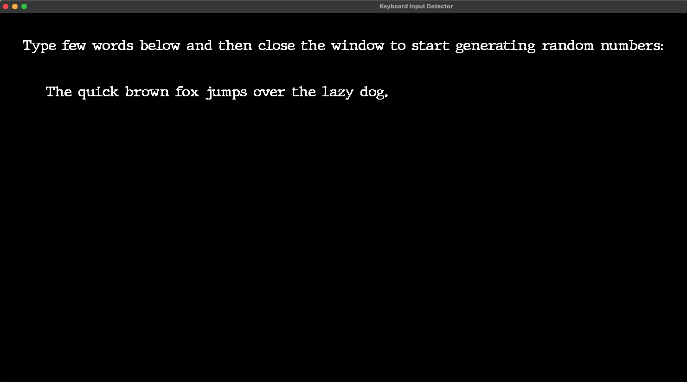
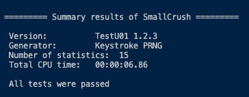

# Keystroke RNG (Keystroke-Based Random Number Generator)

This project implements a **Keystroke-Based Random Number Generator (RNG)**, which uses keystroke timing data as an entropy source. The keystroke timings are collected as the user types in a **SFML-based window**, and this data is used to generate random numbers using a **Mersenne Twister** PRNG (Pseudo-Random Number Generator).

## Project Overview

- **Keystroke Data Collection**: The project collects the **timing data** (key press and release timestamps) as the user types.
- **Entropy Source**: The collected keystroke data is used to generate entropy, which is then used as a seed for the Mersenne Twister algorithm.
- **Random Number Generation**: The program uses the collected keystroke data to generate random numbers.
- **Testing**: The randomness of the generated numbers is tested using the **SmallCrush** test suite from the **TestU01** library to evaluate the quality of the random numbers.

## Features

- **SFML-based GUI**: Displays instructions and dynamically shows the text being typed by the user.
- **Keystroke Timing**: Collects key press and release timings to be used as entropy for random number generation.
- **Mersenne Twister PRNG**: Uses the **Mersenne Twister** algorithm with the collected entropy to generate random numbers.
- **Randomness Testing**: Uses the **SmallCrush** test suite from **TestU01** to evaluate the quality of the generated random numbers.

## Requirements

- **C++11 or later**: Ensure that you are using C++11 or a later version.
- **SFML**: For GUI and event handling.
- **OpenSSL**: For hashing keystroke data with SHA-256.
- **TestU01**: For testing the randomness of the generated numbers.
- **Make**: For building the project.

## Setup Instructions

## 1. Clone the Repository

## 2. Install Dependencies
1. Install SFML: 
    brew install sfml  # On macOS with Homebrew 
    sudo apt-get install libsfml-dev  # On Ubuntu/Debian.

2. Install OpenSSL 
    brew install openssl  # On macOS with Homebrew 
    sudo apt-get install libssl-dev  # On Ubuntu/Debian.

3. Install TestU01 
    brew install testu01  # On macOS with Homebrew 
    http://www.crandell.org/software/testu01/ #For Linux, download and install TestU01 from the official website

## 3. Complile and run
    make
    ./main

# Testing
The random number generator's quality can be tested using the SmallCrush test suite, which is part of the TestU01 package. The generated numbers are tested for uniformity and other statistical properties.

If the PRNG passes the tests, it means that the generated numbers are of high quality. If the PRNG fails the tests, the entropy source (keystroke timings) may need adjustment.

Screenshots

## Keystroke RNG Input:

## Test Results:

# License
This project is licensed under the MIT License - see the LICENSE file for details.
    